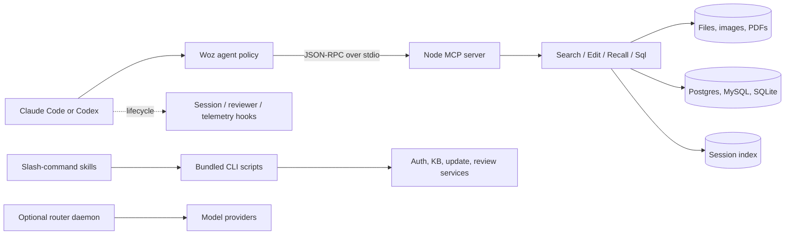

# Architecture

**Summary.** **OBSERVED:** Each host launches a Node MCP server over stdio and steers an agent toward Woz tools. Claude adds a broad hook layer and richer command/knowledge/review surface; Codex packages a smaller parallel copy ([`.mcp.json:2-16`](../../.mcp.json), [`codex/wozcode/.mcp.json:2-15`](../../codex/wozcode/.mcp.json)).

## Component topology

**OBSERVED diagram:**

## Layers

1. **Packaging:** Claude marketplace metadata exposes local plugin `woz` v0.3.87 ([`.claude-plugin/marketplace.json:2-20`](../../.claude-plugin/marketplace.json)). The nested Codex plugin declares `skills` and `mcpServers` at v0.3.70 ([`codex/wozcode/.codex-plugin/plugin.json:2-10`](../../codex/wozcode/.codex-plugin/plugin.json)).
2. **Agent policy:** the main agent blocks native file tools, the free fallback blocks Woz tools, and Explore is a read-only Haiku worker ([`agents/code.md:2-5`](../../agents/code.md), [`agents/code-free.md:2-5`](../../agents/code-free.md), [`agents/explore.md:2-10`](../../agents/explore.md)).
3. **MCP runtime:** the root configuration always loads the server and injects host/version/telemetry environment ([`.mcp.json:2-16`](../../.mcp.json)). A runtime probe observed protocol `2025-03-26`, server `code` v0.3.87, and Edit/Recall/Search/Sql; implementation is anchored in the bundled entrypoint ([`servers/code-server.js:3`](../../servers/code-server.js)).
4. **Lifecycle:** Claude runs bootstrap, reviewer, and telemetry handlers across prompt/tool/stop/compact events ([`hooks/hooks.json:3-113`](../../hooks/hooks.json)). Codex has startup/resume and post-tool hooks ([`codex/wozcode/hooks/hooks.json:3-33`](../../codex/wozcode/hooks/hooks.json)).
5. **Optional subsystems:** consolidated commands expose review and benchmark; `woz-kb` exposes review tuning, backtests, cross-repo planning, and knowledge operations ([`skills/woz/SKILL.md:244-379`](../../skills/woz/SKILL.md), [`skills/woz-kb/SKILL.md:7-21`](../../skills/woz-kb/SKILL.md)).

## Inferred implementation assets

**INFERRED:** native query parsers, `libpg-query.wasm`, tree-sitter grammars, PDF extraction, and syntax-checker chunks likely support structural search/SQL parsing/document extraction. Obfuscated linkage prevents a confident component-to-artifact map.

## Evidence

- `.mcp.json:2-16`, `codex/wozcode/.mcp.json:2-15` — host boot paths.
- `agents/*.md` — policy boundaries.
- `hooks/hooks.json:2-115` — Claude event integration.
- `servers/code-server.js:3` — bundled server/tool registration.

## Related

[Runtime and data flow](runtime-data-flow.md) · [Agents and commands](agents-commands.md) · [Configuration, auth, and telemetry](configuration-auth-telemetry.md)
