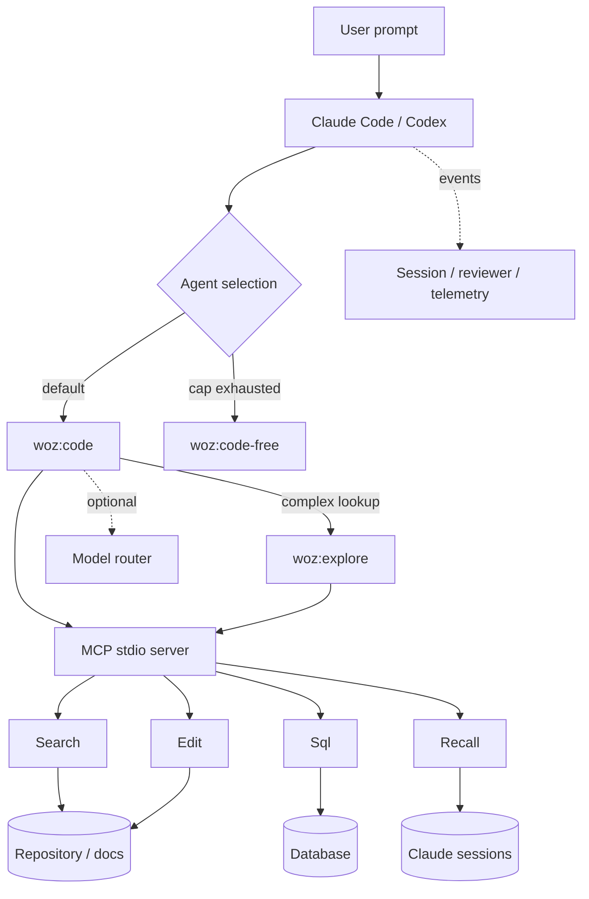

# Runtime and Data Flow

**Summary.** **OBSERVED:** The primary work path is host → selected agent → MCP stdio server → Search/Edit/Recall/Sql. Session, reviewer, and telemetry hooks form lifecycle side paths; a configurable router can redirect model transport ([`.mcp.json:2-16`](../../.mcp.json), [`hooks/hooks.json:3-113`](../../hooks/hooks.json), [`scripts/router-config.jsonc:492-624`](../../scripts/router-config.jsonc)).

## Request flow

**INFERRED diagram, with observed edges:**

## Tool behavior

A harmless MCP `initialize` plus `tools/list` probe observed four tools from [`servers/code-server.js:3`](../../servers/code-server.js):

- **Search:** combined discovery, content search, file/image/PDF reads, and JavaScript/TypeScript summaries/importer analysis.
- **Edit:** batched fuzzy replacements, creation/overwrite, and notebook cell actions.
- **Recall:** semantic lookup over prior Claude sessions; its skill distinguishes enabled and disabled behavior ([`skills/woz-recall/SKILL.md:6-18`](../../skills/woz-recall/SKILL.md)).
- **Sql:** schema discovery, lint/connect/query operations for PostgreSQL, MySQL, and SQLite.

These schemas are runtime-observed; their readable source definitions are not present separately from the bundle.

## Agent and review flow

The main agent delegates sufficiently complex read-only scans to `woz:explore`, which is instructed to return dense path/line results in 3–5 calls and parallelize independent searches ([`README.md:54-61`](../../README.md), [`agents/explore.md:10-18`](../../agents/explore.md), [`agents/explore.md:37-50`](../../agents/explore.md)). Deep review fans out seven narrow personas, then runs a sequential wide-lens pass using their findings and KB context ([`skills/woz/SKILL.md:244-280`](../../skills/woz/SKILL.md)).

## Hook side paths

- `session-hook.js`: session start, prompt submit, pre-tool, and stop failure ([`hooks/hooks.json:3-40`](../../hooks/hooks.json), [`hooks/hooks.json:84-91`](../../hooks/hooks.json)).
- `reviewer-hook.js`: prompt submit and after Woz Edit ([`hooks/hooks.json:22-29`](../../hooks/hooks.json), [`hooks/hooks.json:42-50`](../../hooks/hooks.json)).
- `session-telemetry-hook.js`: every post-tool, subagent/normal stop, and pre/post compact ([`hooks/hooks.json:52-113`](../../hooks/hooks.json)).

## Optional router

**OBSERVED:** router presets map Claude tiers to provider models and rewrite Codex/Azure tool rules toward Woz Search/Edit ([`scripts/router-config.jsonc:19-38`](../../scripts/router-config.jsonc), [`scripts/router-config.jsonc:492-624`](../../scripts/router-config.jsonc)). **INFERRED:** the router daemon is an optional model transport/control plane, not required for core MCP file operations.

## Evidence

- `.mcp.json:2-16` — eager MCP process.
- `servers/code-server.js:3` — bundled registration/transport anchor.
- `agents/explore.md:2-50` — delegation contract.
- `hooks/hooks.json:3-113` — lifecycle paths.

## Related

[Architecture](architecture.md) · [Agents and commands](agents-commands.md) · [Configuration, auth, and telemetry](configuration-auth-telemetry.md)
